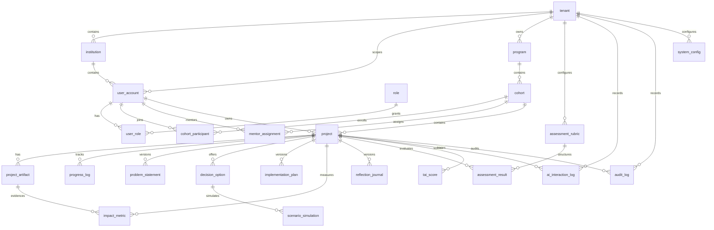

# TEMPA Canonical ERD

## 1. Purpose

This document defines the normalized core entity model for TEMPA MVP and the immediate post-MVP extension path. It replaces parallel high-level, simplified, and production-ready entity lists with one canonical reference model.

## 2. Modeling Principles

- Use a relational core for transactional workflows.
- Separate analytical projections from operational tables.
- Version artifacts that go through review and revision.
- Record approvals, scoring, and AI activity with full traceability.
- Keep the MVP schema minimal but extensible.

## 3. Core Domains And Entities

### Identity And Organization Domain

#### `tenant`
- tenant_id (PK)
- tenant_code
- tenant_name
- tenant_type
- status
- created_at
- updated_at

#### `institution`
- institution_id (PK)
- tenant_id (FK -> tenant.tenant_id)
- institution_name
- institution_type
- region_code
- status
- created_at
- updated_at

#### `user_account`
- user_id (PK)
- tenant_id (FK -> tenant.tenant_id)
- institution_id (FK -> institution.institution_id)
- external_identity_id
- full_name
- email
- phone
- job_title
- grade_level
- status
- last_login_at
- created_at
- updated_at

#### `role`
- role_id (PK)
- role_code
- role_name
- description

#### `user_role`
- user_role_id (PK)
- user_id (FK -> user_account.user_id)
- role_id (FK -> role.role_id)
- scope_type
- scope_id
- assigned_at

### Learning Program Domain

#### `program`
- program_id (PK)
- tenant_id (FK -> tenant.tenant_id)
- program_code
- program_name
- description
- start_date
- end_date
- status
- created_by (FK -> user_account.user_id)
- created_at
- updated_at

#### `cohort`
- cohort_id (PK)
- program_id (FK -> program.program_id)
- cohort_name
- phase_config_json
- start_date
- end_date
- status
- created_at
- updated_at

#### `cohort_participant`
- cohort_participant_id (PK)
- cohort_id (FK -> cohort.cohort_id)
- user_id (FK -> user_account.user_id)
- enrollment_status
- enrolled_at

#### `mentor_assignment`
- mentor_assignment_id (PK)
- cohort_id (FK -> cohort.cohort_id)
- mentor_user_id (FK -> user_account.user_id)
- participant_user_id (FK -> user_account.user_id)
- assigned_at
- active_flag

### Project Workspace Domain

#### `project`
- project_id (PK)
- tenant_id (FK -> tenant.tenant_id)
- cohort_id (FK -> cohort.cohort_id)
- participant_user_id (FK -> user_account.user_id)
- mentor_user_id (FK -> user_account.user_id)
- project_code
- project_title
- project_status
- current_phase
- workflow_state
- started_at
- completed_at
- created_at
- updated_at

#### `project_artifact`
- artifact_id (PK)
- project_id (FK -> project.project_id)
- artifact_type
- file_uri
- file_name
- mime_type
- classification_level
- version_no
- uploaded_by (FK -> user_account.user_id)
- uploaded_at

#### `progress_log`
- progress_log_id (PK)
- project_id (FK -> project.project_id)
- phase_name
- progress_percent
- status_note
- risk_note
- logged_by (FK -> user_account.user_id)
- logged_at

### Analysis And Design Domain

#### `problem_statement`
- problem_id (PK)
- project_id (FK -> project.project_id)
- version_no
- raw_problem_text
- reframed_problem_text
- root_cause_json
- stakeholder_map_json
- competency_gap_json
- workflow_state
- ai_confidence_score
- approved_by (FK -> user_account.user_id)
- approved_at
- created_at
- updated_at

#### `decision_option`
- decision_option_id (PK)
- project_id (FK -> project.project_id)
- option_rank
- option_title
- option_description
- benefit_score
- risk_score
- feasibility_score
- selected_flag
- created_at

#### `scenario_simulation`
- scenario_id (PK)
- project_id (FK -> project.project_id)
- decision_option_id (FK -> decision_option.decision_option_id)
- scenario_name
- input_assumption_json
- output_summary
- risk_tradeoff_json
- simulation_score
- created_at

### Development And Implementation Domain

#### `implementation_plan`
- implementation_plan_id (PK)
- project_id (FK -> project.project_id)
- version_no
- roadmap_json
- milestone_json
- kpi_json
- risk_register_json
- policy_brief_uri
- workflow_state
- approval_status
- approved_by (FK -> user_account.user_id)
- approved_at
- created_at
- updated_at

#### `impact_metric`
- impact_metric_id (PK)
- project_id (FK -> project.project_id)
- metric_code
- metric_name
- baseline_value
- target_value
- actual_value
- unit_of_measure
- measurement_date
- evidence_artifact_id (FK -> project_artifact.artifact_id)
- created_at

### Evaluation Domain

#### `reflection_journal`
- reflection_id (PK)
- project_id (FK -> project.project_id)
- version_no
- reflection_text
- ai_summary
- bias_indicator_json
- growth_indicator_json
- reflective_maturity_score
- workflow_state
- submitted_at
- created_at
- updated_at

#### `assessment_rubric`
- rubric_id (PK)
- tenant_id (FK -> tenant.tenant_id)
- rubric_code
- rubric_name
- rubric_type
- rubric_definition_json
- version_no
- active_flag
- created_at

#### `assessment_result`
- assessment_result_id (PK)
- project_id (FK -> project.project_id)
- rubric_id (FK -> assessment_rubric.rubric_id)
- assessor_user_id (FK -> user_account.user_id)
- assessment_source
- score_json
- comment_text
- submitted_at

#### `tai_score`
- tai_score_id (PK)
- project_id (FK -> project.project_id)
- problem_complexity_score
- decision_quality_score
- impact_score
- reflective_maturity_score
- total_tai_score
- score_version
- published_flag
- calculated_at
- calculated_by (FK -> user_account.user_id)

### AI And Governance Domain

#### `ai_interaction_log`
- ai_log_id (PK)
- tenant_id (FK -> tenant.tenant_id)
- project_id (FK -> project.project_id)
- user_id (FK -> user_account.user_id)
- phase_name
- prompt_template_code
- model_name
- input_hash
- output_hash
- confidence_score
- latency_ms
- token_usage_in
- token_usage_out
- created_at

#### `audit_log`
- audit_log_id (PK)
- tenant_id (FK -> tenant.tenant_id)
- actor_user_id (FK -> user_account.user_id)
- action_type
- target_type
- target_id
- previous_state
- new_state
- action_detail_json
- ip_address
- created_at

#### `system_config`
- config_id (PK)
- tenant_id (FK -> tenant.tenant_id)
- config_key
- config_value_json
- version_no
- active_flag
- updated_at

## 4. Core Relationships

- one `tenant` has many `institution`
- one `institution` has many `user_account`
- one `user_account` has many `user_role`
- one `program` has many `cohort`
- one `cohort` has many `cohort_participant`
- one `cohort` has many `mentor_assignment`
- one `cohort` has many `project`
- one `project` has one current participant and one assigned mentor in MVP
- one `project` has many `project_artifact`
- one `project` has many `progress_log`
- one `project` has many `problem_statement` versions
- one `project` has many `decision_option`
- one `decision_option` has many `scenario_simulation`
- one `project` has many `implementation_plan` versions
- one `project` has many `impact_metric`
- one `project` has many `reflection_journal` versions
- one `project` has many `assessment_result`
- one `project` has many `tai_score` versions
- one `project` has many `ai_interaction_log`
- one `project` has many `audit_log`

## 5. Entity Lifecycle Notes

### Versioned Entities
- `problem_statement`
- `implementation_plan`
- `reflection_journal`
- `tai_score`
- `assessment_rubric`

### State-Controlled Entities
- `project`
- `problem_statement`
- `implementation_plan`
- `reflection_journal`

### Audit-Critical Entities
- `problem_statement`
- `implementation_plan`
- `assessment_result`
- `tai_score`
- `project`

## 6. Mermaid ERD

## 7. Recommended Indexing Baseline

- index all tenant, cohort, project, and user foreign keys
- add composite index on `project(current_phase, workflow_state, project_status)`
- add full-text search on `problem_statement.raw_problem_text` and `reflection_journal.reflection_text`
- add time-based indexes on `audit_log.created_at` and `ai_interaction_log.created_at`

## 8. Immediate Next Schema Decisions

1. Decide whether scenario simulation is in MVP schema or post-MVP extension.
2. Confirm if executive dashboard reads directly from OLTP or from an analytics projection.
3. Confirm whether `published_flag` on `tai_score` is sufficient or needs separate publication history.
4. Decide whether AI prompt registry is stored in `system_config` for MVP or a dedicated table.
