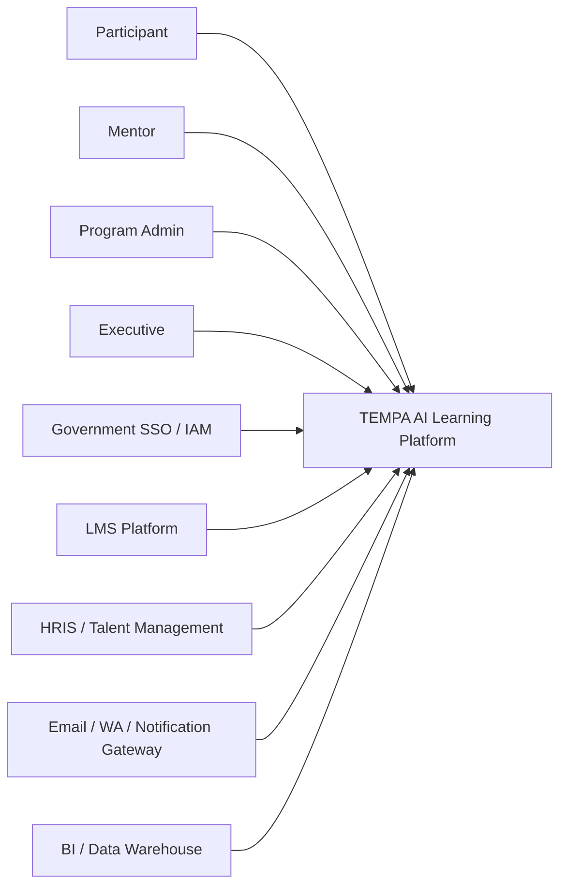
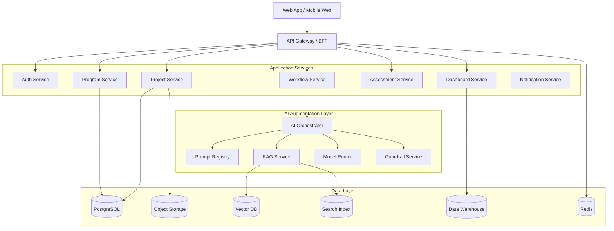
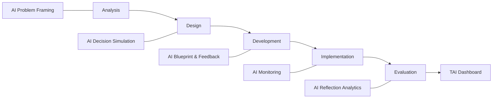
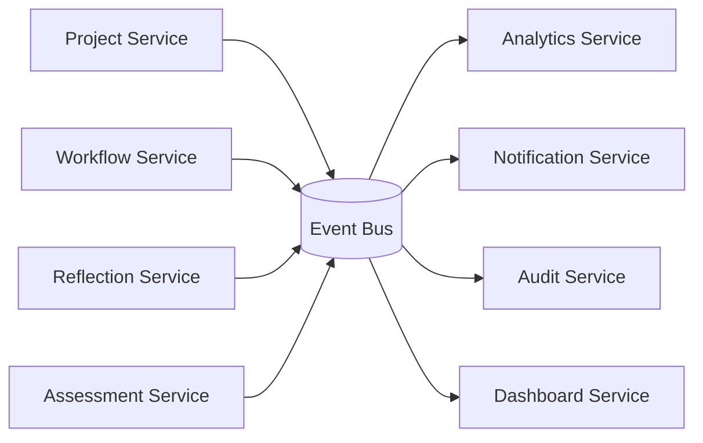
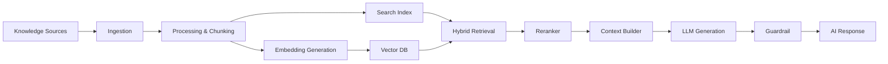

# PRD & FRD
## Platform TEMPA (Transformasi Evidence-Based melalui Proyek dan AI)

---

# PRODUCT REQUIREMENT DOCUMENT (PRD)

## 1. Product Overview
TEMPA adalah platform pembelajaran berbasis proyek untuk pengembangan kompetensi ASN yang mengintegrasikan Artificial Intelligence dalam setiap fase model ADDIE (Analysis, Design, Development, Implementation, Evaluation). Sistem ini berfungsi sebagai laboratorium pembelajaran kepemimpinan berbasis masalah nyata organisasi.

Tujuan utama platform adalah membantu peserta menghasilkan solusi organisasi yang berbasis bukti sekaligus mengukur pertumbuhan kompetensi secara objektif.

---

## 2. Problem Statement
Model pengembangan kompetensi ASN saat ini masih memiliki keterbatasan:

- Pembelajaran terlalu berfokus pada kelas dan sertifikasi.
- Kurangnya keterhubungan antara pelatihan dan masalah strategis organisasi.
- Minimnya personalisasi pembelajaran.
- Pemanfaatan AI belum terintegrasi dalam desain pembelajaran.

Platform TEMPA dirancang untuk mengatasi masalah tersebut dengan menggabungkan project-based learning, AI augmentation, dan evidence-based evaluation.

---

## 3. Product Goals

### Primary Goals

1. Menghubungkan pembelajaran dengan problem nyata organisasi.
2. Meningkatkan kualitas pengambilan keputusan peserta.
3. Menghasilkan solusi organisasi yang terukur dampaknya.
4. Mengukur perkembangan kompetensi peserta secara evidence-based.

### Success Metrics

- Persentase proyek yang menghasilkan implementasi nyata
- Peningkatan indikator kinerja organisasi
- Talent Acceleration Index (TAI) rata-rata peserta
- Tingkat adopsi solusi oleh organisasi

---

## 4. Target Users

### Primary Users

Peserta pelatihan ASN

### Secondary Users

Mentor / Coach

### Tertiary Users

Administrator pelatihan

### Stakeholders

Lembaga pelatihan pemerintah

---

## 5. Core Product Capabilities

### 1. Problem Diagnosis
AI membantu peserta merumuskan masalah strategis dan melakukan root cause analysis.

### 2. Decision Simulation
AI menghasilkan alternatif solusi dan melakukan simulasi risiko.

### 3. Implementation Planning
AI membantu membuat roadmap implementasi.

### 4. Impact Monitoring
AI memonitor hasil implementasi proyek.

### 5. Reflection Analytics
AI menganalisis refleksi peserta.

### 6. Talent Evidence Dashboard
Dashboard yang menampilkan perkembangan kompetensi dan skor TAI.

---

## 6. Product Principles

### Human in the Loop
Keputusan tetap dibuat oleh manusia, AI hanya memberikan rekomendasi.

### Evidence Based Learning
Semua proses pembelajaran menghasilkan data dan bukti.

### Adaptive Learning
AI memberikan rekomendasi pembelajaran sesuai kebutuhan proyek.

### Decision Augmentation
AI meningkatkan kualitas analisis dan pengambilan keputusan.

---

## 7. High Level User Journey

1. Peserta mendaftarkan problem strategis.
2. AI membantu analisis masalah.
3. Peserta merancang solusi.
4. AI melakukan simulasi keputusan.
5. Peserta menyusun rencana implementasi.
6. Peserta menjalankan proyek.
7. AI menganalisis dampak.
8. Peserta menulis refleksi.
9. Sistem menghasilkan Talent Evidence Dashboard.

---

# FUNCTIONAL REQUIREMENT DOCUMENT (FRD)

---

# 1. System Architecture Overview

Platform terdiri dari lima modul utama:

1. Problem Analysis Engine
2. Decision Simulation Engine
3. Implementation Planning Engine
4. Impact Monitoring Engine
5. Reflection Analytics Engine

Semua modul terintegrasi melalui AI Augmentation Layer.

---

# 2. Functional Modules

---

## Module 1 — Problem Analysis

### Description
Membantu peserta mengidentifikasi dan menganalisis problem strategis.

### Features

- Problem statement input
- AI problem reframing
- Root cause analysis
- Stakeholder impact mapping
- Competency gap analysis

### Output

Problem & Learning Diagnostic Report

---

## Module 2 — Decision Design

### Description
Membantu peserta merancang alternatif solusi.

### Features

- Generate solution options
- Risk-benefit analysis
- What-if scenario simulation
- Decision matrix generator

### Output

Decision Design Matrix

---

## Module 3 — Development Planning

### Description
Membantu penyusunan rencana implementasi.

### Features

- Roadmap generator
- KPI definition
- Risk detection
- Policy brief generator

### Output

Implementation Blueprint

---

## Module 4 — Implementation Monitoring

### Description
Menganalisis hasil implementasi proyek.

### Features

- Project progress tracking
- Data upload
- Impact analytics
- Performance deviation detection

### Output

Impact Monitoring Report

---

## Module 5 — Evaluation & Reflection

### Description
Mengevaluasi dampak proyek dan perkembangan kompetensi.

### Features

- Reflection journal submission
- AI reflection analysis
- Bias detection
- Growth trajectory analysis

### Output

Talent Evidence Dashboard

---

# 3. Talent Acceleration Index (TAI)

TAI dihitung berdasarkan empat komponen:

1. Problem Complexity (0–25)
2. Decision Quality (0–30)
3. Impact Score (0–30)
4. Reflective Maturity (0–15)

Total skor = 0 – 100

---

# 4. User Roles

## Participant

- Submit problem
- Develop project
- Upload implementation data
- Submit reflection

## Mentor

- Validate problem
- Review decision design
- Provide feedback

## Administrator

- Manage users
- Configure programs
- Monitor analytics

---

# 5. Data Model (High Level)

Entities:

User

Project

Problem Statement

Decision Option

Implementation Plan

Impact Data

Reflection Journal

TAI Score

---

# 6. Non Functional Requirements

### Scalability
Sistem harus mendukung ribuan peserta.

### Security

- Role based access control
- Data encryption
- Audit trail

### Performance

AI response time < 5 detik

### Availability

99.5% uptime

---

# 7. Future Enhancements

- Integrasi LMS nasional
- Organizational knowledge graph
- Predictive leadership analytics
- Cross-project learning recommendation


---

# SYSTEM DESIGN BLUEPRINT LEVEL ENTERPRISE
## Platform TEMPA (Transformasi Evidence-Based melalui Proyek dan AI)

---

## 1. Executive Summary

System Design Blueprint ini mendefinisikan rancangan arsitektur enterprise untuk platform TEMPA sebagai ekosistem pembelajaran berbasis proyek, evidence-based decision support, dan AI-augmented talent development untuk skala lembaga pelatihan ASN, kementerian, pemerintah daerah, maupun ekosistem nasional.

Blueprint ini dirancang agar platform mampu:

- melayani multi-program dan multi-instansi,
- mendukung ribuan hingga ratusan ribu pengguna,
- mengintegrasikan AI secara aman dan terukur,
- menyediakan auditability dan governance untuk sektor publik,
- menghasilkan insight kompetensi dan dampak organisasi secara real time.

---

## 2. Design Objectives

### 2.1 Business Objectives
- Menghubungkan pembelajaran dengan penyelesaian masalah strategis organisasi.
- Menyediakan platform pengembangan kompetensi ASN berbasis proyek nyata.
- Menghasilkan evidence pembelajaran, dampak implementasi, dan pertumbuhan talenta.
- Mendukung kebijakan pengembangan talenta secara terukur.

### 2.2 Technology Objectives
- High availability untuk skala enterprise.
- Secure-by-design untuk data pemerintah dan data personal.
- AI-ready architecture yang modular dan vendor-agnostic.
- Observability end-to-end untuk operasi platform dan AI services.
- Interoperability dengan LMS, HRIS, SSO, data warehouse, dan sistem pemerintahan lain.

### 2.3 AI Objectives
- Menempatkan AI sebagai augmentation layer, bukan autonomous decision maker.
- Menjamin human-in-the-loop untuk keputusan penting.
- Menyediakan explainability, traceability, dan prompt governance.
- Mengizinkan penggunaan beberapa model AI sesuai use case.

---

## 3. Enterprise Architecture Principles

### 3.1 Domain Driven Design
Platform dipisahkan ke dalam domain bisnis utama: Learning Program, Project Execution, AI Augmentation, Assessment, Talent Analytics, dan Governance.

### 3.2 API First
Semua kapabilitas inti diekspos melalui API terstandar untuk memudahkan integrasi dan reuse.

### 3.3 Event Driven Architecture
Aktivitas kritis seperti project submission, mentor review, AI scoring, dan dashboard refresh dipicu melalui event bus.

### 3.4 Zero Trust Security
Setiap request diverifikasi berdasarkan identitas, peran, konteks, dan kebijakan akses.

### 3.5 Modular AI Integration
LLM, embedding service, reranker, dan analytics engine dipisahkan agar dapat diganti tanpa mengubah domain utama.

### 3.6 Data as a Product
Data pembelajaran, data proyek, data refleksi, dan data evaluasi diperlakukan sebagai aset enterprise dengan owner, metadata, kualitas, dan lineage.

---

## 4. Business Capability Map

Kapabilitas utama platform mencakup:

1. Program & Cohort Management
2. User & Identity Management
3. Problem Intake & Validation
4. AI-Assisted Analysis
5. Solution Design & Simulation
6. Implementation Planning
7. Project Monitoring
8. Reflection & Competency Assessment
9. Talent Evidence Dashboard
10. Reporting & Decision Support
11. Governance, Risk & Compliance
12. Integration & Interoperability

---

## 5. Logical Architecture

Arsitektur logis TEMPA dibagi menjadi 7 lapisan.

### 5.1 Experience Layer
Antarmuka untuk:
- Peserta
- Mentor / Coach
- Administrator Program
- Pimpinan / Pengambil Kebijakan
- Super Admin / Platform Operator

Channel:
- Web Portal
- Mobile Responsive Web
- API Consumer
- Embedded widget untuk LMS / portal instansi

### 5.2 Channel Services Layer
- API Gateway
- BFF (Backend for Frontend)
- Notification Gateway
- File Upload Gateway

### 5.3 Business Application Layer
- Identity & Access Service
- Program Management Service
- Cohort Management Service
- Project Workspace Service
- Assessment Service
- Reflection Service
- Dashboard Service
- Reporting Service
- Admin Configuration Service

### 5.4 AI Augmentation Layer
- Prompt Orchestration Service
- LLM Gateway
- RAG Service
- Embedding Service
- Model Policy Router
- AI Safety Guardrail Service
- AI Output Evaluation Service
- Prompt Registry & Versioning

### 5.5 Data Intelligence Layer
- Operational Data Store
- Document Store
- Search Index
- Vector Database
- Analytics Warehouse
- Feature Store / Scoring Store
- Metadata Catalog

### 5.6 Integration Layer
- SSO / IAM connector
- LMS connector
- HRIS / Talent Management connector
- Email / WhatsApp / Notification connector
- Document management connector
- BI / Data warehouse connector

### 5.7 Platform Foundation Layer
- Kubernetes / Container Platform
- CI/CD pipeline
- Secrets Manager
- Service Mesh
- Monitoring & Logging
- Backup & Disaster Recovery
- Audit & Compliance Stack

---

## 6. Domain Architecture

### 6.1 Identity & Access Domain
Fungsi:
- User onboarding
- SSO / federated login
- Role-based access control
- Attribute-based access control untuk multi-instansi
- Session management
- MFA support

Peran utama:
- Participant
- Mentor
- Program Admin
- Institution Admin
- Executive Viewer
- Platform Operator

### 6.2 Learning Program Domain
Fungsi:
- Pembuatan program
- Pengelolaan cohort
- Assignment mentor
- Penjadwalan fase ADDIE
- Konfigurasi rubrik penilaian
- Konfigurasi template output

### 6.3 Project Workspace Domain
Fungsi:
- Input problem statement
- Penyimpanan artefak proyek
- Versioning dokumen
- Kolaborasi mentor-peserta
- Status workflow setiap fase

### 6.4 AI Assistance Domain
Fungsi:
- Problem reframing
- Root cause suggestion
- Option generation
- Scenario simulation
- Risk analysis
- Reflection analytics
- Micro-learning recommendation
- Policy brief drafting

### 6.5 Assessment & Evaluation Domain
Fungsi:
- Rubric management
- Manual review mentor
- AI-assisted scoring
- TAI calculation
- Bias / anomaly detection
- Growth trajectory generation

### 6.6 Analytics & Leadership Insight Domain
Fungsi:
- Dashboard peserta
- Dashboard mentor
- Dashboard organisasi
- Portfolio proyek
- Talent shortlist recommendation
- Cohort comparison
- Program outcome analytics

---

## 7. Microservices Blueprint

Rekomendasi service decomposition:

1. auth-service
2. user-profile-service
3. tenant-service
4. program-service
5. cohort-service
6. mentor-assignment-service
7. project-service
8. project-artifact-service
9. workflow-service
10. assessment-service
11. rubric-service
12. reflection-service
13. tai-scoring-service
14. reporting-service
15. notification-service
16. audit-service
17. config-service
18. ai-orchestrator-service
19. prompt-registry-service
20. rag-service
21. model-routing-service
22. document-index-service
23. analytics-ingestion-service
24. dashboard-query-service
25. integration-service

Catatan desain:
- Untuk fase awal MVP enterprise, beberapa service dapat digabung menjadi modular monolith.
- Saat trafik meningkat, service AI, analytics, dan reporting dipisahkan karena karakteristik scaling berbeda.

---

## 8. AI System Blueprint

### 8.1 AI Use Case Matrix

#### Analysis Phase
- Problem reframing
- Root cause suggestion
- Problem complexity estimation
- Competency gap extraction

#### Design Phase
- Solution alternative generation
- Risk-benefit analysis
- What-if simulation
- Evidence recommendation

#### Development Phase
- Implementation roadmap generation
- KPI recommendation
- Unintended consequence detection
- Policy brief drafting

#### Implementation Phase
- Progress anomaly detection
- Impact trend analytics
- Adaptive recommendations

#### Evaluation Phase
- Reflection summarization
- Bias identification
- Growth narrative generation
- TAI support scoring

### 8.2 AI Architecture Components
- Prompt templates
- Prompt orchestration engine
- LLM abstraction layer
- Retrieval augmented generation pipeline
- Model evaluation pipeline
- Output validator
- Human approval workflow
- AI trace log

### 8.3 Recommended AI Pattern
Gunakan pola hybrid:
- Foundation model untuk reasoning generatif
- Embedding model untuk semantic retrieval
- Rules engine untuk scoring deterministik
- ML analytics untuk trend dan anomaly detection

### 8.4 Human in the Loop Checkpoints
Human approval wajib pada:
- validasi problem statement final,
- keputusan opsi solusi final,
- pengesahan blueprint implementasi,
- scoring akhir kompetensi,
- shortlist talent recommendation.

### 8.5 AI Guardrails
- Toxicity / unsafe content filter
- PII masking
- Prompt injection detection
- Confidence thresholding
- Source grounding untuk RAG
- Response redaction untuk data sensitif

---

## 9. Data Architecture Blueprint

### 9.1 Data Domains
- Identity Data
- Program Data
- Project Data
- Assessment Data
- Reflection Data
- AI Interaction Data
- Talent Analytics Data
- Audit & Compliance Data

### 9.2 Data Storage Strategy

#### OLTP Relational Database
Untuk:
- user,
- program,
- cohort,
- workflow,
- assessment,
- score,
- approval.

Rekomendasi: PostgreSQL atau enterprise relational equivalent.

#### Document Store / Object Storage
Untuk:
- project artifacts,
- policy brief,
- implementation documents,
- uploaded evidence,
- reflection attachments.

#### Vector Database
Untuk:
- embedding artefak proyek,
- semantic retrieval,
- recommendation context,
- knowledge base retrieval.

#### Search Engine
Untuk full text search lintas dokumen dan proyek.

#### Data Warehouse / Lakehouse
Untuk:
- analytics historis,
- cross-cohort comparison,
- executive dashboard,
- model monitoring,
- longitudinal talent analytics.

### 9.3 Canonical Data Entities
- Tenant
- Institution
- User
- Role
- Program
- Cohort
- Project
- ProblemStatement
- DecisionOption
- ScenarioSimulation
- ImplementationPlan
- ImpactMetric
- ReflectionJournal
- AssessmentRubric
- AssessmentResult
- TAIScore
- AIInteractionLog
- AuditLog

### 9.4 Data Governance
- Data classification: public, internal, restricted, sensitive
- Data retention policy untuk artefak pembelajaran dan log AI
- Metadata catalog untuk dataset utama
- Data lineage untuk dashboard dan scoring
- Consent dan notice untuk data analitik individu

---

## 10. Integration Architecture

### 10.1 Required Enterprise Integrations

#### Identity Integration
- SSO SAML2 / OIDC
- LDAP / Active Directory
- Government IAM

#### Learning Integration
- LMS platform
- SCORM / xAPI consumer
- Content repository

#### HR / Talent Integration
- HRIS
- competency framework repository
- talent management system

#### Communication Integration
- email
- SMS / WhatsApp gateway
- push notification service

#### Analytics Integration
- BI tools
- enterprise data warehouse
- national talent dashboard

### 10.2 Integration Pattern
- Synchronous REST / GraphQL untuk transaksi real time
- Asynchronous event streaming untuk aktivitas dan analytics
- Batch ETL / ELT untuk sinkronisasi historis
- Webhook untuk callback sistem eksternal

---

## 11. Security Architecture

### 11.1 Security Controls
- Single Sign-On
- MFA for privileged users
- RBAC + ABAC
- encryption in transit and at rest
- tenant isolation
- API authentication and throttling
- WAF and DDoS protection
- secrets vault
- immutable audit log

### 11.2 Sensitive Data Protection
- PII tokenization / masking
- data minimization pada prompt AI
- field-level encryption untuk data sensitif
- signed URL untuk akses dokumen terbatas
- restricted export policy

### 11.3 AI Security Controls
- prompt sanitization
- outbound data policy
- model access control
- red team test untuk misuse scenario
- output moderation
- traceable AI request identifiers

### 11.4 Compliance Considerations
Menyesuaikan dengan:
- kebijakan perlindungan data pemerintah,
- regulasi keamanan informasi nasional,
- standar audit internal,
- prinsip etika AI dan akuntabilitas keputusan.

---

## 12. Deployment Architecture

### 12.1 Recommended Deployment Model
Enterprise deployment disarankan menggunakan cloud-native container platform atau sovereign cloud / government private cloud.

Pilihan:
- Public cloud dengan regulatory control
- Private cloud pemerintah
- Hybrid cloud

### 12.2 Environment Strategy
- Dev
- SIT / QA
- UAT
- Staging
- Production
- DR environment

### 12.3 Infrastructure Components
- Kubernetes cluster
- Ingress controller
- API gateway
- service mesh
- managed database cluster
- object storage
- Redis cache
- message broker
- observability stack
- CI/CD runner

### 12.4 Scalability Strategy
- Horizontal pod autoscaling
- Separate worker queues untuk AI workloads
- Read replica untuk analytics query
- Cache layer untuk dashboard dan metadata
- CDN untuk static assets

---

## 13. Observability & SRE Blueprint

### 13.1 Monitoring Layers
- Infrastructure monitoring
- Application monitoring
- Distributed tracing
- Log aggregation
- AI request monitoring
- Data pipeline monitoring

### 13.2 Key SLOs
- Platform availability >= 99.5%
- Core API p95 latency < 500 ms
- AI assist response p95 < 5 detik untuk request standar
- Dashboard refresh SLA < 2 menit untuk near-real-time analytics

### 13.3 Operational Dashboards
- System health dashboard
- API performance dashboard
- AI model usage dashboard
- queue and job processing dashboard
- data freshness dashboard
- security event dashboard

### 13.4 Incident Management
- Severity matrix
- alert routing
- runbook per critical service
- postmortem template
- DR drill schedule

---

## 14. Workflow Architecture by ADDIE Phase

### 14.1 Analysis Workflow
1. Peserta submit problem statement.
2. Workflow engine membuat case ID.
3. AI orchestrator menjalankan reframing dan root cause analysis.
4. Mentor menerima hasil draft untuk validasi.
5. Final diagnostic report disimpan.

### 14.2 Design Workflow
1. Peserta meminta opsi solusi.
2. AI menghasilkan 3–5 opsi.
3. Simulation engine menghitung risk-benefit dan scenario matrix.
4. Mentor mereview opsi prioritas.
5. Decision design matrix dikunci.

### 14.3 Development Workflow
1. Peserta memilih opsi final.
2. AI menyusun roadmap implementasi dan KPI.
3. Rules engine memeriksa kelengkapan blueprint.
4. Mentor menyetujui implementation blueprint.

### 14.4 Implementation Workflow
1. Peserta input progress dan data dampak.
2. Event bus mengirim event ke analytics pipeline.
3. AI / analytics engine mendeteksi deviasi.
4. Sistem mengirim adaptive feedback.
5. Monitoring report diperbarui.

### 14.5 Evaluation Workflow
1. Peserta submit reflection journal.
2. AI menganalisis refleksi dan bias.
3. Assessment service menghitung skor komponen.
4. TAI scoring service menghitung final score.
5. Dashboard menampilkan growth trajectory dan rekomendasi.

---

## 15. TAI Scoring Architecture

### 15.1 Scoring Components
- Problem Complexity Score (0–25)
- Decision Quality Score (0–30)
- Impact Score (0–30)
- Reflective Maturity Score (0–15)

### 15.2 Scoring Mechanism
Rekomendasi pendekatan hybrid:
- rule-based scoring untuk metrik kuantitatif,
- rubric-based scoring oleh mentor,
- AI-assisted text scoring untuk refleksi,
- calibration engine untuk menjaga fairness antar cohort.

### 15.3 Governance for Scoring
- Versi rubric harus tercatat
- Semua perubahan formula harus versioned
- Ada override workflow untuk mentor / admin
- Semua skor AI harus explainable dan traceable

---

## 16. Multi-Tenant Enterprise Model

### 16.1 Tenant Types
- Single institution tenant
- Multi-agency tenant
- National shared platform tenant

### 16.2 Isolation Model
- Logical isolation per tenant di application layer
- Row level security untuk data tenant
- Namespace isolation untuk beberapa service penting
- Encryption key separation untuk tenant tertentu

### 16.3 Configurable Tenant Features
- Branding instansi
- Rubrik penilaian
- Kompetensi framework
- AI model policy
- Notification policy
- Data retention policy

---

## 17. Reference Technology Stack

### Frontend
- React / Next.js enterprise web app
- Design system internal
- State management modern

### Backend
- Java / Kotlin Spring Boot atau Node.js NestJS untuk core services
- Python FastAPI untuk AI orchestration dan data science services

### Data
- PostgreSQL
- Redis
- Object Storage
- Elasticsearch / OpenSearch
- Vector DB
- Data warehouse / lakehouse

### AI
- LLM provider abstraction
- Embedding model service
- RAG pipeline
- MLflow / model registry untuk evaluasi model non-LLM bila diperlukan

### Platform
- Kubernetes
- GitLab CI / GitHub Actions / Jenkins
- ArgoCD / FluxCD
- Prometheus, Grafana, Loki, Tempo / Jaeger
- Vault / Secrets Manager

---

## 18. Release Strategy

### Phase 1 — Foundation MVP
- SSO
- Program & cohort management
- Project workspace
- Analysis AI assistant
- Design AI assistant
- Reflection submission
- Basic TAI scoring
- Basic dashboard

### Phase 2 — Enterprise Expansion
- Full ADDIE workflow
- Mentor review workflow
- AI guardrails
- integration with LMS and HRIS
- advanced reporting
- audit trail and compliance dashboard

### Phase 3 — National Scale Intelligence
- multi-tenant federation
- cross-cohort benchmarking
- talent recommendation engine
- predictive analytics
- knowledge graph and cross-project retrieval

---

## 19. Risks and Mitigation

### Risk 1: Hallucination pada output AI
Mitigasi:
- RAG grounding
- human approval
- prompt policy
- output validator

### Risk 2: Kualitas data implementasi rendah
Mitigasi:
- template input standar
- mandatory evidence fields
- mentor verification
- anomaly detection

### Risk 3: Resistensi pengguna terhadap AI
Mitigasi:
- explainable output
- guided UX
- gradual rollout
- AI transparency notice

### Risk 4: Kebocoran data sensitif
Mitigasi:
- masking
- encryption
- DLP control
- access governance

### Risk 5: Ketidakadilan scoring antar program
Mitigasi:
- rubric standardization
- calibration review
- audit scoring
- fairness monitoring

---

## 20. Recommended Deliverables After Blueprint

Dokumen lanjutan yang sebaiknya dibuat setelah blueprint ini:

1. Solution Architecture Diagram
2. C4 Model (Context, Container, Component)
3. ERD dan canonical data model
4. API Specification
5. AI Prompt Architecture & Prompt Governance
6. Security Architecture Document
7. Data Governance Framework
8. DevSecOps Pipeline Design
9. Sizing & Capacity Plan
10. Implementation Roadmap 12 bulan

---

## 21. Conclusion

Blueprint enterprise TEMPA menempatkan platform bukan sekadar LMS atau aplikasi proyek, tetapi sebagai digital capability system untuk mempercepat pembelajaran, pengambilan keputusan, dan identifikasi talenta berbasis bukti. Arsitektur ini dirancang modular, aman, terukur, dan siap dikembangkan dari level pilot instansi hingga platform nasional.

---

# SOLUTION ARCHITECTURE DIAGRAM

High level solution architecture:

Users (Participant / Mentor / Admin / Executive)

↓

Experience Layer

Web App (React / Next.js)

↓

API Gateway

↓

Application Services

- Program Service
- Project Service
- Workflow Service
- Assessment Service
- Dashboard Service

↓

AI Augmentation Layer

- AI Orchestrator
- Prompt Registry
- RAG Service
- Model Router

↓

Data Layer

- PostgreSQL
- Object Storage
- Vector Database
- Search Index
- Data Warehouse

↓

Integration Layer

- SSO
- LMS
- HRIS
- Notification Services

---

# C4 MODEL

## Context Diagram

Actors:

Participant
Mentor
Program Administrator
Executive / Leadership

External Systems:

Government SSO
LMS Platform
HRIS / Talent Management
Email / Notification System

System:

TEMPA AI Learning Platform

---

## Container Diagram

Containers:

1. Web Application
Frontend interface for users.

2. API Gateway
Entry point for all services.

3. Application Services
Handles core business logic.

4. AI Services
LLM orchestration and analytics.

5. Data Services
Databases, vector store, search index.

6. Analytics Platform
Data warehouse and BI dashboards.

---

## Component Diagram

Inside Application Services:

Program Management Component
Project Workspace Component
Workflow Engine
Assessment Engine
TAI Scoring Engine
Notification Engine

Inside AI Services:

Prompt Engine
RAG Pipeline
Model Router
Reflection Analyzer
Decision Simulation Engine

---

# DATA MODEL (ERD – SIMPLIFIED)

Core Entities:

User
- user_id
- name
- role
- institution_id

Institution
- institution_id
- name

Program
- program_id
- name
- description

Cohort
- cohort_id
- program_id

Project
- project_id
- cohort_id
- user_id

ProblemStatement
- problem_id
- project_id

DecisionOption
- option_id
- project_id

ImplementationPlan
- plan_id
- project_id

ImpactMetric
- metric_id
- project_id

ReflectionJournal
- reflection_id
- project_id

TAIScore
- tai_id
- project_id

AssessmentResult
- assessment_id
- project_id

---

# API SPECIFICATION (HIGH LEVEL)

## Authentication

POST /auth/login
POST /auth/logout
GET /auth/me

---

## Program Management

GET /programs
POST /programs
GET /programs/{id}

GET /cohorts
POST /cohorts

---

## Project Workspace

POST /projects
GET /projects/{id}

POST /projects/{id}/problem
POST /projects/{id}/decision-options
POST /projects/{id}/implementation-plan

---

## AI Assistance

POST /ai/problem-analysis
POST /ai/generate-solutions
POST /ai/simulate-risk
POST /ai/reflection-analysis

---

## Implementation Monitoring

POST /projects/{id}/impact-data
GET /projects/{id}/impact-report

---

## Evaluation

POST /projects/{id}/reflection
GET /projects/{id}/tai-score

---

## Dashboard

GET /dashboard/participant
GET /dashboard/mentor
GET /dashboard/executive

---

# NEXT DESIGN ARTIFACTS (RECOMMENDED)

To move into implementation phase, the following artifacts should be created:

1. Detailed ERD with normalization
2. API OpenAPI specification
3. Prompt library for each ADDIE phase
4. AI evaluation benchmark dataset
5. UI/UX product flow
6. Infrastructure sizing plan
7. Security threat model
8. DevSecOps pipeline design

These artifacts will transform the blueprint into a production-ready system architecture package.

---

# AI ARCHITECTURE & PROMPT LIBRARY (ADDIE PHASES)

## AI Architecture Overview

AI pada platform TEMPA berfungsi sebagai **augmentation layer** yang membantu analisis, simulasi keputusan, dan evaluasi refleksi.

Komponen utama:

1. Prompt Orchestrator
2. Prompt Template Library
3. LLM Gateway
4. Retrieval Augmented Generation (RAG)
5. AI Guardrail Service
6. AI Evaluation Engine

Workflow umum:

User Request → Prompt Orchestrator → Context Retrieval (RAG) → LLM → Guardrail → Response

---

## Prompt Library

### Analysis Phase

Prompt Template:

"You are an organizational strategy analyst. Reframe the following problem statement into a clearer strategic problem. Identify possible root causes and affected stakeholders."

Output:

- reframed problem
- root cause list
- stakeholder impact map

---

### Design Phase

Prompt Template:

"Generate 3–5 alternative interventions to solve the following organizational problem. Provide risk-benefit analysis and potential trade-offs."

Output:

- solution options
- pros and cons
- scenario comparison

---

### Development Phase

Prompt Template:

"Generate an implementation roadmap including milestones, KPIs, and potential unintended consequences."

Output:

- roadmap
- success indicators
- risk flags

---

### Implementation Phase

Prompt Template:

"Analyze the following project implementation data and detect anomalies or deviations from expected outcomes."

Output:

- progress insights
- risk signals
- adaptive recommendation

---

### Evaluation Phase

Prompt Template:

"Analyze the reflection journal and identify learning insights, cognitive bias, and competency growth indicators."

Output:

- reflection summary
- bias detection
- growth indicators

---

# DETAILED ERD (LOGICAL DATABASE MODEL)

## User

user_id (PK)
name
email
role
institution_id
created_at

## Institution

institution_id (PK)
name
type

## Program

program_id (PK)
name
description
start_date
end_date

## Cohort

cohort_id (PK)
program_id (FK)
name

## Project

project_id (PK)
user_id (FK)
cohort_id (FK)
status
created_at

## ProblemStatement

problem_id (PK)
project_id (FK)
problem_text
complexity_score

## DecisionOption

option_id (PK)
project_id (FK)
option_description
risk_score
benefit_score

## ImplementationPlan

plan_id (PK)
project_id (FK)
roadmap_json
kpi_definition

## ImpactMetric

metric_id (PK)
project_id (FK)
metric_name
value
measurement_date

## ReflectionJournal

reflection_id (PK)
project_id (FK)
reflection_text
analysis_summary

## TAIScore

tai_id (PK)
project_id (FK)
problem_complexity
decision_quality
impact_score
reflective_maturity
total_score

---

# MICROSERVICES INTERACTION DIAGRAM (LOGICAL FLOW)

User → API Gateway

API Gateway → Project Service

Project Service → Workflow Service

Workflow Service → AI Orchestrator

AI Orchestrator → LLM Gateway

AI Orchestrator → RAG Service

Workflow Service → Assessment Service

Assessment Service → TAI Scoring Service

TAI Scoring Service → Dashboard Service

Dashboard Service → Frontend

---

# EVENT DRIVEN ARCHITECTURE

Event Bus (Kafka / PubSub)

Events:

ProjectCreated
ProblemSubmitted
DecisionOptionGenerated
ImplementationPlanApproved
ImpactDataUploaded
ReflectionSubmitted
TAIScoreCalculated

Consumers:

Analytics Service
Notification Service
Dashboard Service
Audit Service

---

# UI/UX PRODUCT FLOW

Participant Flow:

Login

→ Join Program

→ Submit Problem

→ AI Assisted Analysis

→ Generate Solution Options

→ Create Implementation Plan

→ Execute Project

→ Submit Reflection

→ View TAI Dashboard

---

Mentor Flow:

Login

→ Review Participant Problem

→ Validate Decision Design

→ Approve Implementation Plan

→ Provide Feedback

→ Review Evaluation

---

Executive Flow:

Login

→ View Organizational Dashboard

→ View Project Portfolio

→ Identify High Potential Talent

→ Monitor Program Impact

---

# INFRASTRUCTURE SIZING (INITIAL ESTIMATE)

For 10,000 active users:

API Services

8–12 application pods

AI Orchestrator

4–6 worker pods

Database

Managed PostgreSQL cluster

Vector Database

3 node cluster

Object Storage

S3 compatible storage

Message Broker

3 node Kafka cluster

Observability Stack

Prometheus + Grafana + Loki

---

# IMPLEMENTATION ROADMAP (12 MONTHS)

Quarter 1

Architecture finalization
Core services development
SSO integration

Quarter 2

AI assistant modules
Project workspace
Assessment module

Quarter 3

Analytics dashboard
AI reflection engine
TAI scoring system

Quarter 4

Enterprise integration
Performance optimization
National scale pilot

---

# FULL ARCHITECTURE DIAGRAM (VISUAL TEXT VERSION)

```text
┌─────────────────────────────────────────────────────────────────────┐
│                         USER / CHANNEL LAYER                       │
│  Participant Portal | Mentor Portal | Admin Portal | Exec Portal   │
│                Web App / Mobile Web / External API                 │
└─────────────────────────────────────────────────────────────────────┘
                                │
                                ▼
┌─────────────────────────────────────────────────────────────────────┐
│                         EDGE / ACCESS LAYER                        │
│      CDN | WAF | Load Balancer | API Gateway | BFF Services        │
└─────────────────────────────────────────────────────────────────────┘
                                │
                                ▼
┌─────────────────────────────────────────────────────────────────────┐
│                     CORE APPLICATION SERVICES                      │
│ Auth Service | User Profile | Program Service | Cohort Service     │
│ Project Service | Workflow Service | Assessment Service            │
│ Reflection Service | Dashboard Service | Notification Service      │
│ Audit Service | Config Service | Reporting Service                 │
└─────────────────────────────────────────────────────────────────────┘
                    │                        │
                    │                        │
                    ▼                        ▼
┌──────────────────────────────┐   ┌─────────────────────────────────┐
│       AI AUGMENTATION        │   │        EVENT / ASYNC LAYER      │
│ AI Orchestrator              │   │ Kafka / PubSub / Message Broker │
│ Prompt Registry              │   │ Domain Events + Background Jobs │
│ Model Router                 │   └─────────────────────────────────┘
│ Guardrail Service            │                 │
│ RAG Service                  │                 ▼
│ Reflection Analyzer          │   ┌─────────────────────────────────┐
│ Decision Simulation Engine   │   │      ANALYTICS / PROCESSING     │
└──────────────────────────────┘   │ ETL / ELT | Stream Processing   │
                    │              │ Scoring Jobs | AI Evaluation     │
                    ▼              └─────────────────────────────────┘
┌─────────────────────────────────────────────────────────────────────┐
│                             DATA LAYER                             │
│ PostgreSQL | Redis | Object Storage | Search Index | Vector DB     │
│ Analytics Warehouse | Metadata Catalog | Audit Log Store           │
└─────────────────────────────────────────────────────────────────────┘
                                │
                                ▼
┌─────────────────────────────────────────────────────────────────────┐
│                        ENTERPRISE INTEGRATION                      │
│ SSO / IAM | LMS | HRIS | Email / WA Gateway | BI / DWH            │
│ Document Repository | National Talent Systems                      │
└─────────────────────────────────────────────────────────────────────┘
```

---

# AI RAG KNOWLEDGE ARCHITECTURE FOR TEMPA

## Objective
Menyediakan retrieval layer yang memperkaya output AI dengan konteks yang relevan, dapat dipertanggungjawabkan, dan sesuai domain ASN / organisasi.

## Knowledge Sources

### Structured Sources
- Competency framework
- Rubric assessment
- KPI catalog
- Program metadata
- TAI scoring rules
- Organization policy metadata

### Unstructured Sources
- Dokumen kebijakan
- Project artifacts peserta
- Reflection journals
- Mentor feedback notes
- Best practice repository
- Learning modules / micro-learning content
- SOP / pedoman instansi

## RAG Pipeline

### 1. Ingestion Layer
- Document uploader
- Connector to LMS / document repository
- Metadata extractor
- OCR optional for scanned documents
- Content normalization

### 2. Processing Layer
- Chunking strategy by semantic section
- Language detection
- PII masking
- Embedding generation
- Keyword extraction
- Metadata tagging

### 3. Storage Layer
- Object storage for original documents
- Search index for lexical retrieval
- Vector database for semantic retrieval
- Metadata catalog for lineage and governance

### 4. Retrieval Layer
Hybrid retrieval:
- lexical search
- semantic vector retrieval
- metadata filtering
- reranking

### 5. Context Assembly Layer
- collect top relevant chunks
- deduplicate overlapping passages
- attach source metadata
- enforce token budget
- apply relevance threshold

### 6. Generation Layer
- prompt builder merges user query + workflow context + retrieved evidence
- model router selects best model
- guardrail checks output before delivery

## RAG Use Cases by Phase

### Analysis
Retrieve:
- strategic planning docs
- competency framework
- prior similar problem cases

### Design
Retrieve:
- intervention patterns
- organizational constraints
- policy references

### Development
Retrieve:
- KPI templates
- implementation playbooks
- policy brief examples

### Implementation
Retrieve:
- monitoring templates
- impact indicators
- historical benchmarks

### Evaluation
Retrieve:
- reflection rubric
- behavior indicators
- growth criteria

## Recommended Knowledge Indexes
- project_artifact_index
- policy_document_index
- competency_framework_index
- mentor_feedback_index
- learning_content_index
- evaluation_rubric_index

## Governance Rules for RAG
- Every retrieved chunk must carry source_id, owner, classification, version.
- Sensitive content must be filtered by access policy.
- Knowledge freshness policy must be enforced for dynamic documents.
- Low confidence retrieval should trigger fallback or human review.

---

# COMPLETE DATABASE SCHEMA (PRODUCTION READY – LOGICAL)

## 1. tenant
- tenant_id (PK)
- tenant_code (UNIQUE)
- tenant_name
- tenant_type
- status
- created_at
- updated_at

## 2. institution
- institution_id (PK)
- tenant_id (FK -> tenant.tenant_id)
- institution_name
- institution_type
- region_code
- status
- created_at
- updated_at

## 3. user_account
- user_id (PK)
- tenant_id (FK)
- institution_id (FK)
- external_identity_id
- full_name
- email
- phone
- job_title
- grade_level
- status
- last_login_at
- created_at
- updated_at

## 4. role
- role_id (PK)
- role_code
- role_name
- description

## 5. user_role
- user_role_id (PK)
- user_id (FK)
- role_id (FK)
- scope_type
- scope_id
- assigned_at

## 6. program
- program_id (PK)
- tenant_id (FK)
- program_code
- program_name
- description
- start_date
- end_date
- status
- created_by
- created_at
- updated_at

## 7. cohort
- cohort_id (PK)
- program_id (FK)
- cohort_name
- phase_config_json
- start_date
- end_date
- status
- created_at
- updated_at

## 8. cohort_participant
- cohort_participant_id (PK)
- cohort_id (FK)
- user_id (FK)
- enrollment_status
- enrolled_at

## 9. mentor_assignment
- mentor_assignment_id (PK)
- cohort_id (FK)
- mentor_user_id (FK -> user_account.user_id)
- participant_user_id (FK -> user_account.user_id)
- assigned_at
- active_flag

## 10. project
- project_id (PK)
- tenant_id (FK)
- cohort_id (FK)
- participant_user_id (FK)
- mentor_user_id (FK)
- project_code
- project_title
- project_status
- current_phase
- started_at
- completed_at
- created_at
- updated_at

## 11. problem_statement
- problem_id (PK)
- project_id (FK)
- version_no
- raw_problem_text
- reframed_problem_text
- root_cause_json
- stakeholder_map_json
- complexity_score
- ai_confidence_score
- approved_by
- approved_at
- created_at

## 12. decision_option
- decision_option_id (PK)
- project_id (FK)
- option_rank
- option_title
- option_description
- benefit_score
- risk_score
- feasibility_score
- selected_flag
- created_at

## 13. scenario_simulation
- scenario_id (PK)
- project_id (FK)
- decision_option_id (FK)
- scenario_name
- input_assumption_json
- output_summary
- risk_tradeoff_json
- simulation_score
- created_at

## 14. implementation_plan
- implementation_plan_id (PK)
- project_id (FK)
- version_no
- roadmap_json
- milestone_json
- kpi_json
- risk_register_json
- policy_brief_uri
- approval_status
- approved_by
- approved_at
- created_at
- updated_at

## 15. project_artifact
- artifact_id (PK)
- project_id (FK)
- artifact_type
- file_uri
- file_name
- mime_type
- version_no
- uploaded_by
- uploaded_at

## 16. impact_metric
- impact_metric_id (PK)
- project_id (FK)
- metric_code
- metric_name
- baseline_value
- target_value
- actual_value
- unit_of_measure
- measurement_date
- evidence_artifact_id (FK -> project_artifact.artifact_id)
- created_at

## 17. progress_log
- progress_log_id (PK)
- project_id (FK)
- phase_name
- progress_percent
- status_note
- risk_note
- logged_by
- logged_at

## 18. reflection_journal
- reflection_id (PK)
- project_id (FK)
- version_no
- reflection_text
- ai_summary
- bias_indicator_json
- growth_indicator_json
- reflective_maturity_score
- submitted_at

## 19. assessment_rubric
- rubric_id (PK)
- tenant_id (FK)
- rubric_code
- rubric_name
- rubric_type
- rubric_definition_json
- version_no
- active_flag
- created_at

## 20. assessment_result
- assessment_result_id (PK)
- project_id (FK)
- rubric_id (FK)
- assessor_user_id (FK)
- assessment_source
- score_json
- comment_text
- submitted_at

## 21. tai_score
- tai_score_id (PK)
- project_id (FK)
- problem_complexity_score
- decision_quality_score
- impact_score
- reflective_maturity_score
- total_tai_score
- score_version
- calculated_at
- calculated_by

## 22. ai_interaction_log
- ai_log_id (PK)
- tenant_id (FK)
- project_id (FK)
- user_id (FK)
- phase_name
- prompt_template_code
- model_name
- input_hash
- output_hash
- confidence_score
- latency_ms
- token_usage_in
- token_usage_out
- created_at

## 23. knowledge_document
- knowledge_document_id (PK)
- tenant_id (FK)
- source_system
- document_title
- document_type
- classification_level
- owner_id
- version_no
- file_uri
- checksum
- indexed_at
- status

## 24. document_chunk
- chunk_id (PK)
- knowledge_document_id (FK)
- chunk_no
- chunk_text
- embedding_vector_ref
- metadata_json
- created_at

## 25. notification_log
- notification_id (PK)
- user_id (FK)
- notification_type
- channel
- subject
- delivery_status
- sent_at

## 26. audit_log
- audit_log_id (PK)
- tenant_id (FK)
- actor_user_id (FK)
- action_type
- target_type
- target_id
- action_detail_json
- ip_address
- created_at

## 27. system_config
- config_id (PK)
- tenant_id (FK)
- config_key
- config_value_json
- version_no
- active_flag
- updated_at

## Recommended Indexing Strategy
- Index on tenant_id, institution_id, cohort_id, project_id, user_id
- Full text index on problem_statement.raw_problem_text and reflection_journal.reflection_text
- Composite index on project(current_phase, project_status)
- Time-based index on audit_log.created_at and ai_interaction_log.created_at
- Vector index on document_chunk.embedding_vector_ref

## Recommended Database Separation
- OLTP schema for transactional services
- Analytics schema / warehouse for dashboard queries
- Audit schema for immutable logs
- Vector store separated for semantic retrieval

---

# FINAL NOTE

Dengan tambahan visual architecture, RAG architecture, dan production-ready logical schema, dokumen Canvas ini sekarang sudah berada pada level **enterprise solution blueprint** yang cukup matang untuk dibawa ke tahap:

1. architecture review,
2. technical design workshop,
3. budgeting dan capacity planning,
4. breakdown ke sprint engineering.

---

# VISUAL DIAGRAM PACK (MERMAID)

## 1. Enterprise Context Diagram



## 2. Container Diagram



## 3. ADDIE Workflow Diagram



## 4. Event-Driven Diagram



## 5. RAG Pipeline Diagram



---

# OPENAPI SPECIFICATION (INITIAL DRAFT)

```yaml
openapi: 3.0.3
info:
  title: TEMPA API
  version: 1.0.0
  description: API for TEMPA AI Learning Platform
servers:
  - url: https://api.tempa.gov
paths:
  /auth/me:
    get:
      summary: Get current authenticated user
      responses:
        '200':
          description: OK

  /programs:
    get:
      summary: List programs
      responses:
        '200':
          description: OK
    post:
      summary: Create program
      responses:
        '201':
          description: Created

  /cohorts:
    post:
      summary: Create cohort
      responses:
        '201':
          description: Created

  /projects:
    post:
      summary: Create project
      responses:
        '201':
          description: Created
    get:
      summary: List projects
      responses:
        '200':
          description: OK

  /projects/{projectId}:
    get:
      summary: Get project detail
      parameters:
        - in: path
          name: projectId
          required: true
          schema:
            type: string
      responses:
        '200':
          description: OK

  /projects/{projectId}/problem:
    post:
      summary: Submit problem statement
      parameters:
        - in: path
          name: projectId
          required: true
          schema:
            type: string
      responses:
        '201':
          description: Created

  /projects/{projectId}/ai/problem-analysis:
    post:
      summary: Generate AI problem analysis
      parameters:
        - in: path
          name: projectId
          required: true
          schema:
            type: string
      responses:
        '200':
          description: OK

  /projects/{projectId}/decision-options:
    post:
      summary: Generate decision options
      parameters:
        - in: path
          name: projectId
          required: true
          schema:
            type: string
      responses:
        '201':
          description: Created

  /projects/{projectId}/simulations:
    post:
      summary: Run scenario simulation
      parameters:
        - in: path
          name: projectId
          required: true
          schema:
            type: string
      responses:
        '201':
          description: Created

  /projects/{projectId}/implementation-plan:
    post:
      summary: Create implementation plan
      parameters:
        - in: path
          name: projectId
          required: true
          schema:
            type: string
      responses:
        '201':
          description: Created

  /projects/{projectId}/impact-metrics:
    post:
      summary: Submit impact metric
      parameters:
        - in: path
          name: projectId
          required: true
          schema:
            type: string
      responses:
        '201':
          description: Created

  /projects/{projectId}/reflections:
    post:
      summary: Submit reflection journal
      parameters:
        - in: path
          name: projectId
          required: true
          schema:
            type: string
      responses:
        '201':
          description: Created

  /projects/{projectId}/tai-score:
    get:
      summary: Get TAI score
      parameters:
        - in: path
          name: projectId
          required: true
          schema:
            type: string
      responses:
        '200':
          description: OK

  /dashboard/participant:
    get:
      summary: Participant dashboard
      responses:
        '200':
          description: OK

  /dashboard/mentor:
    get:
      summary: Mentor dashboard
      responses:
        '200':
          description: OK

  /dashboard/executive:
    get:
      summary: Executive dashboard
      responses:
        '200':
          description: OK
components:
  schemas:
    Program:
      type: object
      properties:
        programId:
          type: string
        name:
          type: string
        description:
          type: string
    Project:
      type: object
      properties:
        projectId:
          type: string
        title:
          type: string
        status:
          type: string
        currentPhase:
          type: string
    ProblemStatement:
      type: object
      properties:
        rawProblemText:
          type: string
        reframedProblemText:
          type: string
    TAIScore:
      type: object
      properties:
        problemComplexityScore:
          type: number
        decisionQualityScore:
          type: number
        impactScore:
          type: number
        reflectiveMaturityScore:
          type: number
        totalTaiScore:
          type: number
```

---

# DEVSECOPS PIPELINE BLUEPRINT

## Pipeline Stages
1. Source Control
2. Static Code Analysis
3. Unit Test
4. Build Container Image
5. Dependency Scan
6. Secret Scan
7. Integration Test
8. API Contract Test
9. IaC Scan
10. Deploy to Staging
11. Security Test / DAST
12. Deploy to Production
13. Post Deploy Smoke Test

## Security Controls
- SAST for backend and frontend code
- container image scanning
- SBOM generation
- secret detection on commits
- IaC scanning for Kubernetes / Terraform
- signed container images
- approval gate for production

---

# SPRINT BREAKDOWN (INITIAL)

## Sprint 1–2
- foundation repo setup
- CI/CD bootstrap
- auth and user service
- program and cohort service

## Sprint 3–4
- project workspace service
- problem statement module
- file upload and artifact module

## Sprint 5–6
- AI orchestrator
- prompt registry
- problem analysis AI flow
- decision options AI flow

## Sprint 7–8
- implementation plan module
- reflection journal module
- mentor review workflow

## Sprint 9–10
- assessment engine
- TAI scoring service
- participant dashboard
- mentor dashboard

## Sprint 11–12
- executive dashboard
- analytics ingestion
- audit and notification services
- production hardening

---

# ARCHITECTURE REVIEW CHECKLIST

## Business
- Are program workflows fully mapped to ADDIE?
- Are mentor approval checkpoints clearly defined?
- Are success metrics measurable and reportable?

## Application
- Are service boundaries aligned with business domains?
- Is there a clear fallback when AI is unavailable?
- Are APIs versioned and secured?

## Data
- Is tenant isolation enforced?
- Are audit and scoring records immutable?
- Is analytics lineage traceable?

## AI
- Are prompts versioned?
- Are AI outputs logged and monitored?
- Is human-in-the-loop enforced for critical decisions?

## Security
- Is SSO integrated?
- Are sensitive fields encrypted?
- Are export and document access policies enforced?

## Operations
- Are SLOs defined?
- Are backups and DR tested?
- Are monitoring dashboards complete?

---

# SERVICE LEVEL DESIGN (PER CORE SERVICE)

## 1. Auth Service
Purpose:
Handle authentication, session management, and SSO federation.

Key Capabilities:
- SSO (OIDC / SAML)
- token issuance (JWT)
- session validation
- MFA for privileged roles

Core Endpoints:
- POST /auth/login
- GET /auth/me
- POST /auth/logout

Dependencies:
- Identity provider
- user_account table

---

## 2. Program Service
Purpose:
Manage training programs and cohorts.

Capabilities:
- create program
- configure ADDIE phases
- manage cohorts
- enroll participants

Core Endpoints:
- POST /programs
- GET /programs
- POST /cohorts
- POST /cohorts/{id}/enroll

Data Tables:
- program
- cohort
- cohort_participant

---

## 3. Project Workspace Service
Purpose:
Manage participant project lifecycle.

Capabilities:
- create project
- manage project phases
- store artifacts
- track project status

Core Endpoints:
- POST /projects
- GET /projects/{id}
- POST /projects/{id}/artifacts

Data Tables:
- project
- project_artifact

---

## 4. Workflow Service
Purpose:
Control ADDIE lifecycle and approval steps.

Capabilities:
- phase transition validation
- mentor approval workflow
- event emission

Events Produced:
- ProblemSubmitted
- DesignApproved
- PlanApproved
- ReflectionSubmitted

---

## 5. AI Orchestrator Service
Purpose:
Coordinate all AI operations.

Capabilities:
- build prompts
- fetch knowledge context
- route model request
- evaluate AI output

Key Components:
- prompt registry
- RAG retrieval module
- guardrail validator

---

## 6. Assessment Service
Purpose:
Evaluate project outcomes and competencies.

Capabilities:
- rubric scoring
- mentor evaluation
- AI assisted scoring

Data Tables:
- assessment_rubric
- assessment_result

---

## 7. TAI Scoring Service
Purpose:
Compute Talent Acceleration Index.

Formula:

TAI = ProblemComplexity + DecisionQuality + Impact + ReflectiveMaturity

Score Range:
0–100

Capabilities:
- compute score
- version scoring rules
- calibration adjustment

---

# PROMPT GOVERNANCE FRAMEWORK

## Prompt Lifecycle
1. Prompt Draft
2. Internal Review
3. Prompt Evaluation
4. Production Deployment
5. Continuous Monitoring

## Prompt Registry Fields
- prompt_id
- phase_name
- prompt_template
- version
- owner
- evaluation_score

## Prompt Monitoring Metrics
- hallucination rate
- response relevance
- latency
- token cost

---

# DATA PIPELINE ARCHITECTURE

Stages:

1. Event Capture
Events from application services pushed to event bus.

2. Stream Processing
Real-time processing for dashboard updates.

3. Data Transformation
ETL jobs normalize project and scoring data.

4. Warehouse Storage
Aggregated datasets stored for analytics queries.

5. BI Consumption
Executive dashboards and reports generated.

Tools Typically Used:

- Kafka / PubSub
- Stream processor
- Data warehouse
- BI dashboard platform

---

# CAPACITY PLANNING MODEL

Example Scenario:

Users: 50,000
Concurrent users: 5,000
Projects per year: 20,000
AI requests per project: 20

Estimated AI requests/year:

400,000 requests

Infrastructure Planning:

API Cluster
- 15–20 pods

AI Workers
- 8–12 pods

Database
- 3 node HA cluster

Vector Database
- 3 node cluster

Event Streaming
- 3 broker nodes

---

# COST OPTIMIZATION STRATEGY

1. Use model routing (cheap vs high reasoning models).
2. Cache frequent retrieval results.
3. Batch AI analytics jobs.
4. Use async pipelines for heavy processing.
5. Archive cold project data to cheaper storage.

---

# FUTURE PLATFORM CAPABILITIES

## Knowledge Graph
Map relationships between:
- problems
- interventions
- competencies
- impact results

## Cross Project Intelligence
AI identifies similar projects across agencies.

## Leadership Pattern Detection
Identify behavioral patterns linked to high impact leaders.

## Policy Simulation Engine
Simulate impact of policy decisions before implementation.

---

# FINAL ARCHITECTURE MATURITY MODEL

Level 1 – Pilot Platform
Single institution deployment.

Level 2 – Enterprise Platform
Multi-agency adoption.

Level 3 – National Talent Intelligence Platform
Cross-government analytics and talent discovery.

---

---

# UI / UX WIREFRAME BLUEPRINT (TEXTUAL)

## Participant Dashboard

Main Sections:

1. My Program
2. My Project
3. AI Assistant
4. Progress Tracker
5. Reflection Journal
6. TAI Score

Wireframe Layout:

Header
- Program name
- Cohort
- Mentor

Main Panel

Left Sidebar
- Analysis
- Design
- Development
- Implementation
- Evaluation

Center Workspace
- Problem Statement Editor
- AI Assistance Panel
- Document Upload

Right Panel
- AI Suggestions
- Knowledge References

Footer
- Save Draft
- Submit for Mentor Review

---

## Mentor Dashboard

Sections:

- Assigned Participants
- Review Queue
- Feedback Panel
- Approval Workflow

Mentor Actions:

- Approve problem framing
- Review decision options
- Validate implementation plan
- Provide reflection feedback

---

## Executive Dashboard

Key Widgets:

- Program Impact Overview
- Portfolio of Projects
- Talent Acceleration Index Distribution
- High Potential Talent List
- Organizational Impact Metrics

Visualization Types:

- heatmap of projects
- cohort comparison chart
- TAI score distribution
- impact KPI dashboard

---

# AI DECISION SIMULATION ENGINE DESIGN

Purpose:

Allow participants to simulate potential outcomes of strategic interventions before implementation.

Components:

1. Scenario Generator
2. Assumption Engine
3. Simulation Model
4. Risk Evaluation Module
5. Recommendation Engine

Workflow:

User selects decision option

↓

User inputs assumptions

↓

Scenario Generator creates multiple scenarios

↓

Simulation Engine evaluates outcomes

↓

Risk Module calculates trade-offs

↓

AI generates recommendation summary

Output:

- scenario comparison table
- risk probability map
- expected impact projection

---

# NATIONAL TALENT INTELLIGENCE ARCHITECTURE

Purpose:

Aggregate learning outcomes, project impacts, and competency growth across institutions to identify emerging leaders and strategic capabilities.

Key Layers:

1. Data Aggregation Layer
2. Talent Analytics Engine
3. Competency Graph
4. Cross Agency Benchmarking
5. Leadership Discovery Engine

---

## Talent Analytics Engine

Capabilities:

- cross cohort comparison
- talent trajectory analysis
- leadership readiness scoring


Inputs:

- TAI scores
- project impact metrics
- reflection analytics

Outputs:

- high potential talent index
- competency heatmap
- leadership pipeline insights

---

## Competency Knowledge Graph

Nodes:

- Competency
- Project
- Intervention
- Outcome
- Participant

Edges:

- demonstrates
- improves
- applies
- influences

Use Cases:

- identify best practice interventions
- map competencies to outcomes
- recommend learning pathways

---

# STRATEGIC VALUE OF TEMPA PLATFORM

For Participants:

- experiential learning
- decision making capability
- reflective leadership growth

For Institutions:

- innovation lab for organizational problems
- measurable training outcomes

For National Governance:

- talent intelligence
- leadership pipeline discovery
- evidence based policy improvement

---

# FINAL REMARK

TEMPA platform architecture combines project based learning, AI augmented decision support, and enterprise scale analytics to create a next generation public sector capability platform.

---

# TEMPA PLATFORM PITCH ARCHITECTURE (EXECUTIVE VIEW)

## Vision

TEMPA adalah platform **AI-augmented leadership and capability development system** yang mengubah pelatihan ASN dari model kelas menjadi **laboratorium penyelesaian masalah organisasi berbasis data dan AI**.

## Strategic Layers

1. Learning Layer
Project-based learning berbasis ADDIE.

2. Decision Augmentation Layer
AI membantu analisis, simulasi keputusan, dan refleksi.

3. Evidence Layer
Semua aktivitas menghasilkan data evidence pembelajaran.

4. Talent Intelligence Layer
Data proyek dan refleksi menghasilkan insight talenta.

5. Governance Layer
Audit, transparansi, dan akuntabilitas AI.


## Strategic Outcomes

For Government:

- measurable capability development
- innovation driven bureaucracy
- evidence based policy learning

For Talent System:

- leadership pipeline discovery
- competency analytics
- cross agency learning network

---

# AI MODEL STRATEGY

## AI Model Categories

### 1. Foundation LLM
Purpose:
Reasoning, summarization, and structured generation.

Use cases:
- problem reframing
- solution generation
- reflection analysis

### 2. Embedding Model
Purpose:
Semantic search and document retrieval.

Use cases:
- RAG knowledge retrieval
- similar project discovery

### 3. Reranker Model
Purpose:
Improve retrieval quality for relevant knowledge chunks.

### 4. Rule Based Scoring Engine
Purpose:
Deterministic evaluation for scoring metrics.

### 5. ML Analytics Models
Purpose:
Trend analysis and anomaly detection.

Examples:
- project impact trend
- learning trajectory detection

---

## Model Routing Strategy

Requests classified into:

Low reasoning tasks
→ cheaper fast model

Medium reasoning tasks
→ balanced reasoning model

High reasoning tasks
→ advanced reasoning model

Benefits:

- cost control
- response speed
- workload optimization

---

# IMPLEMENTATION TEAM STRUCTURE

## Core Leadership

Program Director
Product Lead
Chief Architect
AI Lead

---

## Engineering Team

Backend Engineers (4–6)
Frontend Engineers (3–4)
AI Engineers (3–4)
Data Engineers (2–3)
DevOps Engineers (2)
QA Engineers (2)

---

## Product & Research

UX Designer (2)
Learning Scientist (1–2)
AI Evaluation Specialist (1)
Policy & Governance Advisor (1)

---

# IMPLEMENTATION BUDGET ESTIMATION (HIGH LEVEL)

## Development Cost (Year 1)

Platform engineering

Estimated:
USD 1.2M – 1.8M

Includes:

- engineering salaries
- infrastructure
- AI model cost
- security and compliance

---

## Infrastructure Cost

Estimated annual cost:

USD 150k – 300k

Includes:

- compute
- storage
- AI inference
- monitoring

---

## Operational Team

Estimated annual cost:

USD 600k – 900k

Includes:

- engineering
- AI ops
- platform ops

---

# IMPLEMENTATION PHASES

## Phase 1 — Pilot

Single institution deployment

Duration:
6 months

Features:

- project workspace
- AI analysis
- reflection engine
- TAI scoring

---

## Phase 2 — Multi Institution

Deployment across ministries / agencies

Duration:
12 months

Features:

- enterprise integrations
- analytics dashboards
- mentor workflows

---

## Phase 3 — National Intelligence Platform

Cross government capability intelligence.

Features:

- national talent analytics
- cross project knowledge graph
- leadership discovery engine

---

# STRATEGIC IMPACT POTENTIAL

If implemented nationally, TEMPA can:

- transform civil service learning
- create measurable competency growth
- generate policy innovation from real projects
- build national leadership intelligence

---

---

# VISUAL SYSTEM ARCHITECTURE (REFERENCE ARCHITECTURE DESCRIPTION)

This section describes how the TEMPA platform can be deployed using a modern cloud-native architecture (AWS / GCP / Azure / Sovereign Gov Cloud equivalent).

## Edge Layer

Components:

- CDN
- Web Application Firewall (WAF)
- Global Load Balancer

Responsibilities:

- protect platform from attacks
- accelerate global access
- route traffic to regional clusters

---

## Application Gateway Layer

Components:

- API Gateway
- Backend for Frontend (BFF)

Responsibilities:

- request routing
- authentication token validation
- rate limiting
- API version control

---

## Microservices Compute Layer

Hosted on Kubernetes cluster.

Core Services:

- auth-service
- program-service
- cohort-service
- project-service
- workflow-service
- assessment-service
- dashboard-service
- notification-service

AI Services:

- ai-orchestrator
- rag-service
- prompt-registry
- model-router

Supporting Services:

- audit-service
- config-service
- integration-service

---

## AI Processing Layer

Handles heavy AI workloads separately from core transactional services.

Components:

- AI worker nodes
- LLM gateway
- embedding service
- reranker service

Capabilities:

- scalable inference
- prompt orchestration
- knowledge retrieval

---

## Data Layer

Data systems include:

Relational Database
- PostgreSQL cluster

Object Storage
- artifact storage

Vector Database
- semantic embeddings

Search Engine
- full text search

Analytics Warehouse
- aggregated learning analytics

Cache
- Redis for session and query cache

---

## Integration Layer

External integrations:

- Government SSO / IAM
- LMS systems
- HRIS / Talent management systems
- Email and messaging services
- Business intelligence platforms

Integration patterns:

- REST APIs
- event streaming
- scheduled data sync

---

# TEMPA INNOVATION NARRATIVE (SMART EDU AI CHALLENGE READY)

## Problem

Public sector learning systems often focus on knowledge transfer rather than solving real organizational challenges. Training outcomes rarely translate into measurable improvements in policy or operations.

## Innovation

TEMPA transforms training into a **real-world decision laboratory**.

Participants work on real organizational problems while AI acts as a **cognitive co-pilot** that supports:

- problem reframing
- decision simulation
- implementation planning
- reflective learning

Unlike traditional AI learning tools, TEMPA integrates AI directly into the **ADDIE learning cycle**.

This creates a continuous loop of:

Problem → Decision → Action → Reflection → Evidence.

## Key Differentiators

1. AI as decision augmentation, not just content generation.
2. Project outcomes tied directly to organizational impact.
3. Talent development measured through real-world evidence.
4. National-scale talent intelligence potential.

## Impact

TEMPA enables governments to:

- accelerate leadership capability development
- generate innovation through real organizational projects
- identify high-potential leaders using data-driven evidence

---

# AI EVALUATION FRAMEWORK

To ensure trustworthy AI usage in TEMPA, an evaluation framework is required.

## Evaluation Dimensions

### 1. Accuracy

Measures how correct AI outputs are compared to expert evaluation.

Metrics:

- factual accuracy
- recommendation validity

---

### 2. Relevance

Measures alignment with user problem context.

Metrics:

- semantic similarity
- expert rating

---

### 3. Explainability

Measures whether AI outputs provide understandable reasoning.

Indicators:

- structured reasoning
- cited evidence from RAG

---

### 4. Safety

Ensures AI avoids harmful or sensitive outputs.

Controls:

- prompt filtering
- output moderation
- PII detection

---

### 5. Consistency

Measures stability of responses across repeated prompts.

Indicators:

- response variance
- scoring deviation

---

## Evaluation Methods

1. Human expert review
2. Automated benchmark dataset
3. Shadow evaluation during production
4. Continuous prompt improvement

---

## AI Monitoring Dashboard

Metrics monitored in production:

- hallucination rate
- latency
- token cost
- response rating
- model usage distribution

---

# FINAL SUMMARY

The TEMPA architecture package now includes:

- Product Requirements
- Functional Requirements
- Enterprise System Architecture
- AI Architecture
- RAG Knowledge System
- Microservices Design
- Event Driven Architecture
- Data Architecture
- DevSecOps Pipeline
- UI/UX Design
- AI Decision Simulation Engine
- National Talent Intelligence Layer
- Visual Architecture
- API Specification
- Implementation Strategy
- Innovation Narrative
- AI Evaluation Framework

This complete blueprint can support:

- national AI learning platform proposals
- enterprise architecture approval
- engineering implementation
- AI governance review

END OF ENTERPRISE SYSTEM DESIGN PACKAGE

